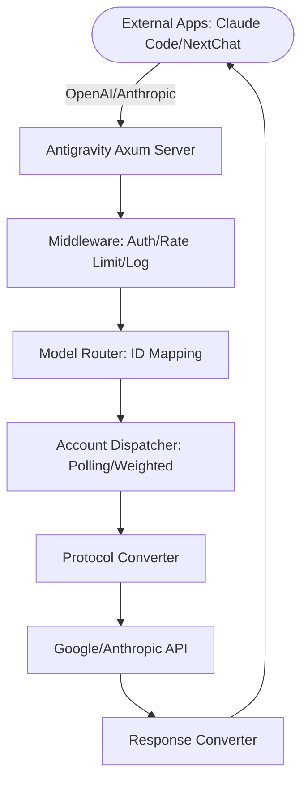

# Antigravity Tools 🚀

> Professional AI Account Management & Reverse Proxy System (v4.1.10)
> 
> Sistem Manajemen Akun AI & Reverse Proxy Profesional (v4.1.10)

<div align="center">
  

  <h3>Your Personal High-Performance AI Gateway</h3>
  <h4>Gateway AI Performa Tinggi Personal Anda</h4>
  
  <p>
    <a href="https://github.com/Vaquerosx/Antigravityy-manager-setup">
      
    </a>
    
    
    
    
  </p>
</div>

---

## 🌐 Choose Language / Pilih Bahasa

| Language | Documentation |
|:--------:|:-------------:|
| 🇮🇩 Bahasa Indonesia | [README_ID.md](./README_ID.md) |
| 🇬🇧 English | [README_EN.md](./README_EN.md) |

---

## ⚡ Quick Overview

**Antigravity Tools** is a full-featured desktop application designed for developers and AI enthusiasts. It combines multi-account management, protocol conversion, and intelligent request scheduling.

**Antigravity Tools** adalah aplikasi desktop lengkap yang dirancang untuk developer dan penggemar AI. Aplikasi ini menggabungkan manajemen multi-akun, konversi protokol, dan penjadwalan permintaan cerdas.

---

## 🌟 Key Features / Fitur Utama

| Feature | Description |
|---------|-------------|
| 🎛️ **Smart Dashboard** | Real-time monitoring of all account quotas |
| 🔐 **Account Management** | OAuth 2.0 authorization, multi-import support |
| 🔌 **API Proxy** | OpenAI, Anthropic, Gemini protocol support |
| 🔀 **Model Router** | Intelligent routing & load balancing |
| 🎨 **Imagen 3** | Advanced image generation support |

---

## 📦 Installation

### Option A: Terminal Installation (macOS & Linux Recommended)

#### macOS
If you have [Homebrew](https://brew.sh/) installed, run:

```bash
# 1. Tap the repository
brew tap lbjlaq/antigravity-manager https://github.com/lbjlaq/Antigravity-Manager

# 2. Install the app
brew install --cask antigravity-tools
```

> **Tip**: If you encounter permission issues, add the `--no-quarantine` flag.

#### Arch Linux
You can choose to install via the one-click script or Homebrew:

**Option 1: One-click script (Recommended)**
```bash
curl -sSL https://raw.githubusercontent.com/lbjlaq/Antigravity-Manager/main/deploy/arch/install.sh | bash
```

**Option 2: via Homebrew** (If you have [Linuxbrew](https://sh.brew.sh/) installed)
```bash
brew tap lbjlaq/antigravity-manager https://github.com/lbjlaq/Antigravity-Manager
brew install --cask antigravity-tools
```

#### Other Linux Distributions
The AppImage will be automatically symlinked to your binary path with executable permissions.

---

### Option B: Manual Download

Download from [GitHub Releases](https://github.com/lbjlaq/Antigravity-Manager/releases):
- **macOS**: `.dmg` (Universal, Apple Silicon & Intel)
- **Windows**: `.msi` or portable `.zip`
- **Linux**: `.deb` or `AppImage`

---

### Option C: Docker Deployment (Recommended for NAS/Servers)

If you prefer running in a containerized environment, we provide a native Docker image. This image supports the v4.0.3 Native Headless architecture, automatically hosts frontend static resources, and allows for direct browser-based management.

```bash
# Option 1: Direct Run (Recommended)
# - API_KEY: Required. Used for AI request authentication.
# - WEB_PASSWORD: Optional. Used for Web UI login. Defaults to API_KEY if NOT set.
docker run -d --name antigravity-manager \
  -p 8045:8045 \
  -e API_KEY=sk-your-api-key \
  -e WEB_PASSWORD=your-login-password \
  -e ABV_MAX_BODY_SIZE=104857600 \
  -v ~/.antigravity_tools:/root/.antigravity_tools \
  lbjlaq/antigravity-manager:latest

# Forgot keys? Run:
# docker logs antigravity-manager
# or
# grep -E '"api_key"|"admin_password"' ~/.antigravity_tools/gui_config.json
```

#### 🔐 Authentication Scenarios

| Scenario | Web Login | API Calls |
|----------|-----------|-----------|
| **Only `API_KEY` set** | Use `API_KEY` | Use `API_KEY` |
| **Both `API_KEY` and `WEB_PASSWORD` set** ✅ | Must use `WEB_PASSWORD` | Use `API_KEY` |

> **Recommended**: Set both for security - share API Key with team, keep password for admin only.

#### 🆙 Upgrade Guide for Older Versions

If upgrading from v4.0.1 or earlier, set `WEB_PASSWORD` via:

1. **Web UI** (Recommended): Login → API Proxy Settings → Set password → Save
2. **Environment Variable**: Add `-e WEB_PASSWORD=your_password` to Docker run
3. **Config File**: Edit `~/.antigravity_tools/gui_config.json` → add `"admin_password": "your_password"` in `proxy` object

> [!TIP]
> **Priority**: Environment Variable > Config File > API_KEY fallback

#### Docker Compose

```bash
# 1. Enter the Docker directory
cd docker
# 2. Start the service
docker compose up -d
```

**Access URLs:**
- Admin Console: `http://localhost:8045`
- API Base: `http://localhost:8045/v1`

**System Requirements:**
- **RAM**: 1GB recommended (minimum 256MB)
- **Persistence**: Mount `/root/.antigravity_tools`
- **Architecture**: x86_64 and ARM64

📖 See: [Docker Deployment Guide](./docker/README.md)

---

## 🛠️ Troubleshooting

### macOS says "App is damaged"?

Due to macOS security gatekeeper, non-App Store apps might show this. Run in Terminal:

```bash
sudo xattr -rd com.apple.quarantine "/Applications/Antigravity Tools.app"
```

Or install with:
```bash
brew install --cask --no-quarantine antigravity-tools
```

---

## 🔌 Quick Integration Examples

### 🔐 OAuth Authorization Flow (Add Account)

1. Go to **Accounts** → **Add Account** → **OAuth**
2. The dialog pre-generates an authorization URL. Click to copy, then open in your browser
3. After consent, browser shows "✅ Authorized successfully!"
4. App automatically saves the account (or click "I already authorized, continue")

> **Note**: Auth URL contains one-time callback port. Always use the latest URL from dialog.

---

### Claude Code CLI

1. Start Antigravity service in the "API Proxy" tab
2. In your terminal:

```bash
export ANTHROPIC_API_KEY="sk-antigravity"
export ANTHROPIC_BASE_URL="http://127.0.0.1:8045"
claude
```

---

### OpenCode Integration

1. Go to **API Proxy** → **External Providers** → click **OpenCode Sync** card
2. Click **Sync** to generate `~/.config/opencode/opencode.json`
3. Optional: Check **Sync accounts** to export `antigravity-accounts.json`
4. Windows path: `C:\Users\<User>\.config\opencode\`
5. Use **Restore** button to revert from backup if needed

---

### Python

```python
import openai

client = openai.OpenAI(
    api_key="sk-antigravity",
    base_url="http://127.0.0.1:8045/v1"
)

response = client.chat.completions.create(
    model="gemini-3-flash",
    messages=[{"role": "user", "content": "Hello, please introduce yourself"}]
)
print(response.choices[0].message.content)
```

---

### Image Generation (Imagen 3)

```python
import openai
import base64

client = openai.OpenAI(
    api_key="sk-antigravity",
    base_url="http://127.0.0.1:8045/v1"
)

response = client.images.generate(
    model="gemini-3-pro-image",
    prompt="A futuristic cyberpunk city with neon lights",
    size="1920x1080",
    quality="hd",
    n=1,
    response_format="b64_json"
)

image_data = base64.b64decode(response.data[0].b64_json)
with open("output.png", "wb") as f:
    f.write(image_data)
```

**Parameters:**
- `size`: Any `WIDTHxHEIGHT` (e.g., `1920x1080`, `1024x1024`)
- `quality`: `"hd"` (4K), `"medium"` (2K), `"standard"` (default)
- `n`: Number of images (1-10)

---

## 📸 Screenshots

| Dashboard | Account List |
|:---------:|:------------:|
|  |  |

| API Proxy | Settings |
|:---------:|:--------:|
|  |  |

---

## 🏗️ Architecture



---

## 📝 Full Documentation

For complete documentation in your language:
- 🇮🇩 [Bahasa Indonesia - README_ID.md](./README_ID.md)
- 🇬🇧 [English - README_EN.md](./README_EN.md)

---

## 👥 Credits

**Original Author**: [lbjlaq](https://github.com/lbjlaq)

**Modified by**: [Vaquerosx](https://github.com/Vaquerosx)

---

**Copyright © 2024-2026**
