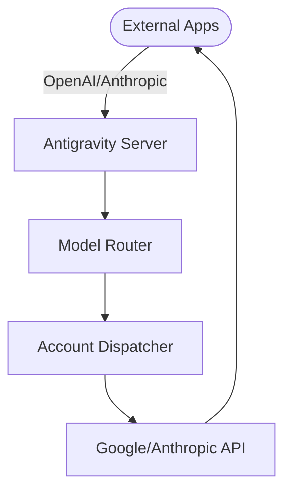

# Antigravity Tools 🚀

> Professional AI Account Management & Reverse Proxy System (v4.1.10)
> 
> Sistem Manajemen Akun AI & Reverse Proxy Profesional (v4.1.10)

<div align="center">
  

  <h3>Your Personal High-Performance AI Gateway</h3>
  <h4>Gateway AI Performa Tinggi Personal Anda</h4>
  
  <p>
    <a href="https://github.com/Vaquerosx/Antigravityy-manager-setup">
      
    </a>
    
    
    
    
  </p>
</div>

---

## 🌐 Choose Language / Pilih Bahasa

| Language | Documentation |
|:--------:|:-------------:|
| 🇮🇩 Bahasa Indonesia | [README_ID.md](./README_ID.md) |
| 🇬🇧 English | [README_EN.md](./README_EN.md) |

---

## ⚡ Quick Overview

**Antigravity Tools** is a full-featured desktop application designed for developers and AI enthusiasts. It combines multi-account management, protocol conversion, and intelligent request scheduling.

**Antigravity Tools** adalah aplikasi desktop lengkap yang dirancang untuk developer dan penggemar AI. Aplikasi ini menggabungkan manajemen multi-akun, konversi protokol, dan penjadwalan permintaan cerdas.

---

## 🌟 Key Features / Fitur Utama

| Feature | Description |
|---------|-------------|
| 🎛️ **Smart Dashboard** | Real-time monitoring of all account quotas |
| 🔐 **Account Management** | OAuth 2.0 authorization, multi-import support |
| 🔌 **API Proxy** | OpenAI, Anthropic, Gemini protocol support |
| 🔀 **Model Router** | Intelligent routing & load balancing |
| 🎨 **Imagen 3** | Advanced image generation support |

---

## 📦 Quick Install / Instalasi Cepat

### Docker (Recommended)
```bash
docker run -d --name antigravity-manager \
  -p 8045:8045 \
  -e API_KEY=sk-your-api-key \
  -v ~/.antigravity_tools:/root/.antigravity_tools \
  lbjlaq/antigravity-manager:latest
```

### Manual Download
Visit [GitHub Releases](https://github.com/lbjlaq/Antigravity-Manager/releases):
- **macOS**: `.dmg` (Apple Silicon & Intel)
- **Windows**: `.msi` or `.zip`
- **Linux**: `.deb` or `AppImage`

---

## 🔌 Quick Integration

### Claude Code CLI
```bash
export ANTHROPIC_API_KEY="sk-antigravity"
export ANTHROPIC_BASE_URL="http://127.0.0.1:8045"
claude
```

### Python
```python
import openai

client = openai.OpenAI(
    api_key="sk-antigravity",
    base_url="http://127.0.0.1:8045/v1"
)

response = client.chat.completions.create(
    model="gemini-3-flash",
    messages=[{"role": "user", "content": "Hello!"}]
)
print(response.choices[0].message.content)
```

---

## 📸 Screenshots

| Dashboard | Account List |
|:---------:|:------------:|
|  |  |

| API Proxy | Settings |
|:---------:|:--------:|
|  |  |

---

## 🏗️ Architecture



---

## 📝 Documentation

For detailed documentation, please see:
- 🇮🇩 [Bahasa Indonesia](./README_ID.md)
- 🇬🇧 [English](./README_EN.md)

---

## 👥 Credits

**Original Author**: [lbjlaq](https://github.com/lbjlaq)

**Modified by**: [Vaquerosx](https://github.com/Vaquerosx)

---

**Copyright © 2024-2026**
