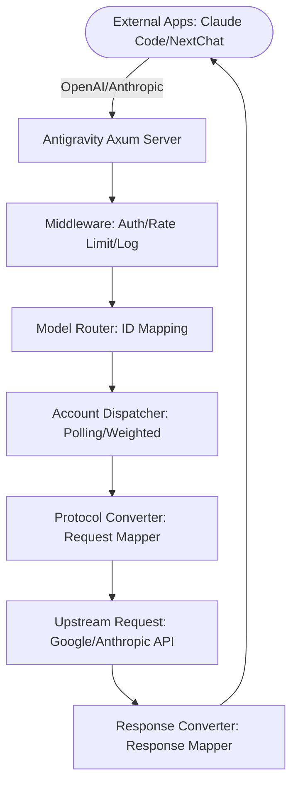

# Antigravity Tools 🚀
> Professional AI Account Management & Reverse Proxy System (v4.1.10)

<div align="center">
  

  <h3>Your Personal High-Performance AI Gateway</h3>
  <p>More than just account management – the ultimate solution to break through API calling barriers.</p>
  
  <p>
    <a href="https://github.com/Vaquerosx/Antigravity-Manager">
      
    </a>
    
    
    
    
  </p>

  <p>
    <a href="#-core-features">Core Features</a> • 
    <a href="#-screenshots">Screenshots</a> • 
    <a href="#%EF%B8%8F-architecture">Architecture</a> • 
    <a href="#-installation-guide">Installation</a> • 
    <a href="#-quick-integration">Quick Integration</a>
  </p>

  <p>
    <a href="./README_ID.md">Bahasa Indonesia</a> | 
    <strong>English</strong>
  </p>
</div>

---

**Antigravity Tools** is a full-featured desktop application designed specifically for developers and AI enthusiasts. It perfectly combines multi-account management, protocol conversion, and intelligent request scheduling, providing you with a stable, ultra-fast, and cost-effective **local AI relay station**.

Through this application, you can transform common Web Sessions (Google/Anthropic) into standardized API interfaces, eliminating protocol gaps between different vendors.

## 🌟 Core Features

### 1. 🎛️ Smart Dashboard
*   **Global Real-time Monitoring**: Get a glimpse of all account health statuses, including **average remaining quotas** for Gemini Pro, Gemini Flash, Claude, and Gemini Drawing.
*   **Best Account Recommendation**: The system filters and recommends the "best account" based on real-time quota redundancy, supporting **one-click switching**.
*   **Active Account Snapshot**: Displays specific quota percentages and last sync time of active accounts.

### 2. 🔐 Powerful Account Management
*   **OAuth 2.0 Authorization (Auto/Manual)**: When adding accounts, a copyable authorization link is pre-generated, supporting authorization completion in any browser.
*   **Multi-dimensional Import**: Supports single Token input, JSON batch import, and automatic hot migration from V1 legacy database.
*   **Gateway-level View**: Supports dual view switching between "List" and "Grid". Provides 403 block detection, automatically marking and skipping accounts with permission anomalies.

### 3. 🔌 Protocol Conversion & Relay (API Proxy)
*   **Multi-Protocol Adaptation**:
    *   **OpenAI Format**: Provides `/v1/chat/completions` endpoint, compatible with 99% of existing AI applications.
    *   **Anthropic Format**: Provides native `/v1/messages` interface, supporting full **Claude Code CLI** functionality.
    *   **Gemini Format**: Supports direct calls from official Google SDK.
*   **Intelligent Status Self-healing**: When requests encounter `429 (Too Many Requests)` or `401 (Expire)`, the backend triggers **automatic retry & silent rotation** in milliseconds.

### 4. 🔀 Model Routing Center
*   **Series Mapping**: Classify complex original model IDs into "spec families" (e.g., route all GPT-4 requests to `gemini-3-pro-high`).
*   **Expert-level Redirect**: Supports custom regex-level model mapping.
*   **Smart Tiered Routing**: [New] System automatically prioritizes based on account type (Ultra/Pro/Free) and quota reset frequency.
*   **Background Task Silent Downgrade**: [New] Automatically identifies background requests (like title generation) and redirects to Flash models.

### 5. 🎨 Multimodal & Imagen 3 Support
*   **Advanced Image Quality Control**: Supports automatic mapping of OpenAI `size` parameters (like `1024x1024`, `16:9`) to Imagen 3 specifications.
*   **Super Body Support**: Backend supports Payloads up to **100MB**, more than sufficient for 4K HD image recognition.

## 📸 Screenshots

| | |
| :---: | :---: |
|  <br> Dashboard |  <br> Account List |
|  <br> About Page |  <br> API Proxy |
|  <br> System Settings | |

### 💡 Usage Examples

| | |
| :---: | :---: |
|  <br> Claude Code Web Search |  <br> Cherry Studio Integration |
|  <br> Imagen 3 Drawing |  <br> Kilo Code Integration |

## 🏗️ Architecture



## 📦 Installation Guide

### Option A: Terminal Installation (macOS & Linux)

#### macOS 
If you have [Homebrew](https://brew.sh/) installed:

```bash
# 1. Subscribe to this repository's Tap
brew tap lbjlaq/antigravity-manager https://github.com/lbjlaq/Antigravity-Manager

# 2. Install the application
brew install --cask antigravity-tools
```
> **Tip**: If you encounter permission issues, add the `--no-quarantine` parameter.

#### Arch Linux
**Method 1: One-click Install Script (Recommended)**
```bash
curl -sSL https://raw.githubusercontent.com/lbjlaq/Antigravity-Manager/main/deploy/arch/install.sh | bash
```

**Method 2: Via Homebrew**
```bash
brew tap lbjlaq/antigravity-manager https://github.com/lbjlaq/Antigravity-Manager
brew install --cask antigravity-tools
```

### Option B: Manual Download
Visit [GitHub Releases](https://github.com/lbjlaq/Antigravity-Manager/releases) to download:
*   **macOS**: `.dmg` (supports Apple Silicon & Intel)
*   **Windows**: `.msi` or portable `.zip`
*   **Linux**: `.deb` or `AppImage`

### Option C: Docker Deployment (for NAS/Servers)

```bash
docker run -d --name antigravity-manager \
  -p 8045:8045 \
  -e API_KEY=sk-your-api-key \
  -e WEB_PASSWORD=your-login-password \
  -e ABV_MAX_BODY_SIZE=104857600 \
  -v ~/.antigravity_tools:/root/.antigravity_tools \
  lbjlaq/antigravity-manager:latest
```

> **Access Addresses**: `http://localhost:8045` (Admin Dashboard) | `http://localhost:8045/v1` (API Base)
> 
> **System Requirements**:
> - **Memory**: Recommended **1GB** (minimum 256MB).
> - **Persistence**: Mount `/root/.antigravity_tools` to save data.
> - **Architecture**: Supports x86_64 and ARM64.
> 
> **Details**: [Docker Deployment Guide](./docker/README.md)

---

Copyright © 2024-2026 [lbjlaq](https://github.com/lbjlaq)

### 🛠️ Troubleshooting

#### macOS shows "Application is damaged, can't be opened"?
Due to macOS security mechanisms, apps downloaded outside the App Store may trigger this message.

1.  **Command Line Fix** (Recommended):
    ```bash
    sudo xattr -rd com.apple.quarantine "/Applications/Antigravity Tools.app"
    ```
2.  **Homebrew Installation Tip**:
    ```bash
    brew install --cask --no-quarantine antigravity-tools
    ```

## 🔌 Quick Integration

### 🔐 OAuth Authorization Flow (Adding Accounts)
1. Open "Accounts" → "Add Account" → "OAuth".
2. The popup will pre-generate an authorization link; click to copy to clipboard, then open with your preferred browser.
3. After authorization is complete, the browser will open a local callback page showing "✅ Authorization Successful!".
4. The application will automatically complete and save the account.

> Tip: The authorization link contains a one-time callback port, always use the latest link from the popup.

### How to Integrate with Claude Code CLI?
1.  Start Antigravity, and enable the service on the "API Proxy" page.
2.  In terminal, run:
```bash
export ANTHROPIC_API_KEY="sk-antigravity"
export ANTHROPIC_BASE_URL="http://127.0.0.1:8045"
claude
```

### How to Integrate with OpenCode?
1.  Go to **API Proxy** page → **External Providers** → click **OpenCode Sync** card.
2.  Click **Sync** button to auto-generate `~/.config/opencode/opencode.json` config file.
3.  Optional: Check **Sync accounts** to export `antigravity-accounts.json`.
4.  Windows path: `C:\Users\<username>\.config\opencode\`.
5.  To restore, click **Restore** button to recover from backup.

### How to Integrate with Kilo Code?
1.  **Protocol Choice**: Recommended to use **Gemini Protocol**.
2.  **Base URL**: Fill in `http://127.0.0.1:8045`.
3.  **Notes**: 
    - **OpenAI Protocol Limitation**: Kilo Code in OpenAI mode generates non-standard path `/v1/chat/completions/responses`, causing Antigravity to return 404. Use Gemini mode instead.
    - **Model Mapping**: If unable to connect, set custom mapping in "Model Mapping" page.

### How to Use in Python?
```python
import openai

client = openai.OpenAI(
    api_key="sk-antigravity",
    base_url="http://127.0.0.1:8045/v1"
)

response = client.chat.completions.create(
    model="gemini-3-flash",
    messages=[{"role": "user", "content": "Hello, please introduce yourself"}]
)
print(response.choices[0].message.content)
```

### How to Use Image Generation (Imagen 3)?

#### Method 1: OpenAI Images API (Recommended)
```python
import openai
import base64

client = openai.OpenAI(
    api_key="sk-antigravity",
    base_url="http://127.0.0.1:8045/v1"
)

# Generate image
response = client.images.generate(
    model="gemini-3-pro-image",
    prompt="A futuristic cyberpunk city with neon lights",
    size="1920x1080",
    quality="hd",
    n=1,
    response_format="b64_json"
)

# Save image
image_data = base64.b64decode(response.data[0].b64_json)
with open("output.png", "wb") as f:
    f.write(image_data)
```

**Supported Parameters**:
- **`size`**: Any `WIDTHxHEIGHT` format (e.g., `1280x720`, `1024x1024`, `1920x1080`)
- **`quality`**: 
  - `"hd"` → 4K resolution (high quality)
  - `"medium"` → 2K resolution (medium quality)
  - `"standard"` → Default resolution (standard quality)
- **`n`**: Number of images (1-10)
- **`response_format`**: `"b64_json"` or `"url"` (Data URI)

#### Method 2: Chat API + Parameters (✨ New)

All protocols (OpenAI, Claude) Chat API now support `size` and `quality` parameters:

```python
# OpenAI Chat API
response = client.chat.completions.create(
    model="gemini-3-pro-image",
    size="1920x1080",
    quality="hd",
    messages=[{"role": "user", "content": "A futuristic city"}]
)
```

#### Method 3: Chat + Model Suffix
```python
response = client.chat.completions.create(
    model="gemini-3-pro-image-16-9-4k",  # Format: gemini-3-pro-image-[ratio]-[quality]
    messages=[{"role": "user", "content": "A futuristic city"}]
)
```

**Suffix Description**:
- **Ratio**: `-16-9`, `-9-16`, `-4-3`, `-3-4`, `-21-9`, `-1-1`
- **Quality**: `-4k` (4K), `-2k` (2K), no suffix (standard)
- **Example**: `gemini-3-pro-image-16-9-4k` → 16:9 ratio + 4K resolution

---

## 📝 Developers & Community

### 👥 Core Contributors
Thanks to all contributors who have helped develop this project!

### 🤝 Special Thanks
This project is inspired and supported by various other amazing open source projects.

---

**Copyright © 2024-2026 [lbjlaq](https://github.com/lbjlaq)**

**Modified by [Vaquerosx](https://github.com/Vaquerosx)**
