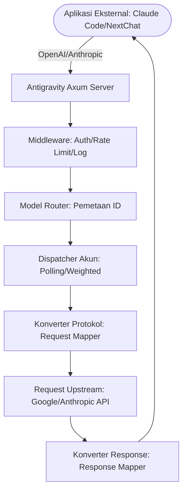

# Antigravity Tools 🚀
> Sistem Manajemen Akun AI & Reverse Proxy Profesional (v4.1.10)

<div align="center">
  

  <h3>Gateway AI Performa Tinggi Personal Anda</h3>
  <p>Bukan hanya manajemen akun, tapi solusi ultimat untuk mendobrak batasan panggilan API.</p>
  
  <p>
    <a href="https://github.com/Vaquerosx/Antigravity-Manager">
      
    </a>
    
    
    
    
  </p>

  <p>
    <a href="#-fitur-utama">Fitur Utama</a> • 
    <a href="#-screenshot">Screenshot</a> • 
    <a href="#%EF%B8%8F-arsitektur">Arsitektur</a> • 
    <a href="#-panduan-instalasi">Instalasi</a> • 
    <a href="#-integrasi-cepat">Integrasi Cepat</a>
  </p>

  <p>
    <strong>Bahasa Indonesia</strong> | 
    <a href="./README_EN.md">English</a>
  </p>
</div>

---

**Antigravity Tools** adalah aplikasi desktop lengkap yang dirancang khusus untuk developer dan penggemar AI. Aplikasi ini menggabungkan manajemen multi-akun, konversi protokol, dan penjadwalan permintaan cerdas, menyediakan **stasiun perantara AI lokal** yang stabil, super cepat, dan hemat biaya.

Melalui aplikasi ini, Anda dapat mengubah Session Web umum (Google/Anthropic) menjadi antarmuka API standar, menghilangkan kesenjangan protokol antar vendor yang berbeda.

## 🌟 Fitur Utama

### 1. 🎛️ Dashboard Akun Cerdas
*   **Pemantauan Real-time Global**: Lihat sekilas status kesehatan semua akun, termasuk **kuota rata-rata tersisa** untuk Gemini Pro, Gemini Flash, Claude, dan Gemini Drawing.
*   **Rekomendasi Akun Terbaik**: Sistem menyaring dan merekomendasikan "akun terbaik" berdasarkan redundansi kuota real-time, mendukung **pergantian satu klik**.
*   **Snapshot Akun Aktif**: Menampilkan persentase kuota spesifik dan waktu sinkronisasi terakhir akun aktif.

### 2. 🔐 Manajer Akun Canggih
*   **Otorisasi OAuth 2.0 (Otomatis/Manual)**: Saat menambah akun, link otorisasi yang dapat disalin akan dihasilkan terlebih dahulu, mendukung penyelesaian otorisasi di browser manapun.
*   **Import Multi-dimensi**: Mendukung input Token tunggal, import batch JSON, dan migrasi otomatis dari database versi lama V1.
*   **Tampilan Level Gateway**: Mendukung pergantian dual view "List" dan "Grid". Menyediakan deteksi blokir 403, otomatis menandai dan melewatkan akun dengan anomali izin.

### 3. 🔌 Konversi & Relay Protokol (API Proxy)
*   **Adaptasi Multi-Protokol**:
    *   **Format OpenAI**: Menyediakan endpoint `/v1/chat/completions`, kompatibel dengan 99% aplikasi AI yang ada.
    *   **Format Anthropic**: Menyediakan antarmuka native `/v1/messages`, mendukung fitur lengkap **Claude Code CLI**.
    *   **Format Gemini**: Mendukung panggilan langsung Google SDK resmi.
*   **Self-healing Status Cerdas**: Saat request menemui `429 (Too Many Requests)` atau `401 (Expire)`, backend akan memicu **retry otomatis & rotasi silent** dalam milidetik.

### 4. 🔀 Pusat Routing Model
*   **Pemetaan Seri**: Klasifikasikan ID model kompleks ke "keluarga spesifikasi" (seperti routing semua request GPT-4 ke `gemini-3-pro-high`).
*   **Redirect Tingkat Expert**: Mendukung pemetaan model tingkat regex kustom.
*   **Routing Bertingkat Cerdas**: [Baru] Sistem otomatis mengurutkan prioritas berdasarkan tipe akun (Ultra/Pro/Free) dan frekuensi reset kuota.
*   **Downgrade Silent Tugas Background**: [Baru] Otomatis mengidentifikasi request background (seperti pembuatan judul) dan redirect ke model Flash.

### 5. 🎨 Dukungan Multimodal & Imagen 3
*   **Kontrol Kualitas Gambar Tingkat Lanjut**: Mendukung pemetaan otomatis parameter OpenAI `size` (seperti `1024x1024`, `16:9`) ke spesifikasi Imagen 3.
*   **Dukungan Body Super**: Backend mendukung Payload hingga **100MB**, memadai untuk pengenalan gambar HD 4K.

## 📸 Screenshot

| | |
| :---: | :---: |
|  <br> Dashboard |  <br> Daftar Akun |
|  <br> Halaman Tentang |  <br> API Proxy |
|  <br> Pengaturan Sistem | |

### 💡 Contoh Penggunaan

| | |
| :---: | :---: |
|  <br> Claude Code Pencarian Web |  <br> Cherry Studio Integrasi |
|  <br> Imagen 3 Gambar |  <br> Kilo Code Integrasi |

## 🏗️ Arsitektur



## 📦 Panduan Instalasi

### Opsi A: Instalasi Terminal (macOS & Linux)

#### macOS 
Jika Anda sudah menginstall [Homebrew](https://brew.sh/):

```bash
# 1. Subscribe ke Tap repository ini
brew tap lbjlaq/antigravity-manager https://github.com/lbjlaq/Antigravity-Manager

# 2. Install aplikasi
brew install --cask antigravity-tools
```
> **Tips**: Jika menemui masalah izin, tambahkan parameter `--no-quarantine`.

#### Arch Linux
**Cara 1: Script Install Satu Klik (Direkomendasikan)**
```bash
curl -sSL https://raw.githubusercontent.com/lbjlaq/Antigravity-Manager/main/deploy/arch/install.sh | bash
```

**Cara 2: Melalui Homebrew**
```bash
brew tap lbjlaq/antigravity-manager https://github.com/lbjlaq/Antigravity-Manager
brew install --cask antigravity-tools
```

### Opsi B: Download Manual
Kunjungi [GitHub Releases](https://github.com/lbjlaq/Antigravity-Manager/releases) untuk download:
*   **macOS**: `.dmg` (mendukung Apple Silicon & Intel)
*   **Windows**: `.msi` atau versi portable `.zip`
*   **Linux**: `.deb` atau `AppImage`

### Opsi C: Deploy Docker (untuk NAS/Server)

```bash
docker run -d --name antigravity-manager \
  -p 8045:8045 \
  -e API_KEY=sk-your-api-key \
  -e WEB_PASSWORD=your-login-password \
  -e ABV_MAX_BODY_SIZE=104857600 \
  -v ~/.antigravity_tools:/root/.antigravity_tools \
  lbjlaq/antigravity-manager:latest
```

> **Alamat Akses**: `http://localhost:8045` (Dashboard Admin) | `http://localhost:8045/v1` (API Base)
> 
> **Persyaratan Sistem**:
> - **Memory**: Direkomendasikan **1GB** (minimum 256MB).
> - **Persistent Storage**: Mount `/root/.antigravity_tools` untuk menyimpan data.
> - **Arsitektur**: Mendukung x86_64 dan ARM64.
> 
> **Detail**: [Panduan Deploy Docker](./docker/README.md)

---

Copyright © 2024-2026 [lbjlaq](https://github.com/lbjlaq)

### 🛠️ Troubleshooting

#### macOS menampilkan "Aplikasi rusak, tidak dapat dibuka"?
Karena mekanisme keamanan macOS, aplikasi yang didownload dari luar App Store mungkin memunculkan pesan ini.

1.  **Perbaikan Command Line** (Direkomendasikan):
    ```bash
    sudo xattr -rd com.apple.quarantine "/Applications/Antigravity Tools.app"
    ```
2.  **Tips Instalasi Homebrew**:
    ```bash
    brew install --cask --no-quarantine antigravity-tools
    ```

## 🔌 Integrasi Cepat

### 🔐 Alur Otorisasi OAuth (Menambah Akun)
1. Buka "Accounts / Akun" → "Tambah Akun" → "OAuth".
2. Popup akan menghasilkan link otorisasi; klik untuk copy ke clipboard, lalu buka dengan browser pilihan Anda.
3. Setelah otorisasi selesai, browser akan membuka halaman callback lokal menampilkan "✅ Otorisasi Berhasil!".
4. Aplikasi akan otomatis menyelesaikan dan menyimpan akun.

> Tips: Link otorisasi berisi port callback satu kali, selalu gunakan link terbaru dari popup.

### Cara Integrasi dengan Claude Code CLI?
1.  Jalankan Antigravity, dan aktifkan layanan di halaman "API Proxy".
2.  Di terminal, jalankan:
```bash
export ANTHROPIC_API_KEY="sk-antigravity"
export ANTHROPIC_BASE_URL="http://127.0.0.1:8045"
claude
```

### Cara Integrasi dengan OpenCode?
1.  Masuk ke halaman **API Proxy** → **External Providers** → klik kartu **OpenCode Sync**.
2.  Klik tombol **Sync**, akan otomatis generate file config `~/.config/opencode/opencode.json`.
3.  Opsional: Centang **Sync accounts** untuk export `antigravity-accounts.json`.
4.  Path Windows: `C:\Users\<username>\.config\opencode\`.
5.  Untuk restore, klik tombol **Restore** untuk memulihkan dari backup.

### Cara Integrasi dengan Kilo Code?
1.  **Pilihan Protokol**: Direkomendasikan menggunakan **Protokol Gemini**.
2.  **Base URL**: Isi `http://127.0.0.1:8045`.
3.  **Catatan**: 
    - **Batasan Protokol OpenAI**: Kilo Code dalam mode OpenAI menghasilkan path non-standar `/v1/chat/completions/responses`, menyebabkan Antigravity mengembalikan 404. Gunakan mode Gemini.
    - **Pemetaan Model**: Jika tidak dapat terhubung, atur pemetaan kustom di halaman "Model Mapping".

### Cara Menggunakan di Python?
```python
import openai

client = openai.OpenAI(
    api_key="sk-antigravity",
    base_url="http://127.0.0.1:8045/v1"
)

response = client.chat.completions.create(
    model="gemini-3-flash",
    messages=[{"role": "user", "content": "Halo, perkenalkan dirimu"}]
)
print(response.choices[0].message.content)
```

### Cara Menggunakan Image Generation (Imagen 3)?

#### Cara 1: OpenAI Images API (Direkomendasikan)
```python
import openai
import base64

client = openai.OpenAI(
    api_key="sk-antigravity",
    base_url="http://127.0.0.1:8045/v1"
)

# Generate gambar
response = client.images.generate(
    model="gemini-3-pro-image",
    prompt="Kota futuristik bergaya cyberpunk dengan lampu neon",
    size="1920x1080",
    quality="hd",
    n=1,
    response_format="b64_json"
)

# Simpan gambar
image_data = base64.b64decode(response.data[0].b64_json)
with open("output.png", "wb") as f:
    f.write(image_data)
```

**Parameter yang Didukung**:
- **`size`**: Format `WIDTHxHEIGHT` apapun (seperti `1280x720`, `1024x1024`, `1920x1080`)
- **`quality`**: 
  - `"hd"` → Resolusi 4K (kualitas tinggi)
  - `"medium"` → Resolusi 2K (kualitas menengah)
  - `"standard"` → Resolusi default (kualitas standar)
- **`n`**: Jumlah gambar (1-10)
- **`response_format`**: `"b64_json"` atau `"url"` (Data URI)

#### Cara 2: Chat API + Parameter (✨ Baru)

Semua protokol (OpenAI, Claude) Chat API sekarang mendukung parameter `size` dan `quality`:

```python
# OpenAI Chat API
response = client.chat.completions.create(
    model="gemini-3-pro-image",
    size="1920x1080",
    quality="hd",
    messages=[{"role": "user", "content": "Kota futuristik"}]
)
```

#### Cara 3: Chat + Suffix Model
```python
response = client.chat.completions.create(
    model="gemini-3-pro-image-16-9-4k",  # Format: gemini-3-pro-image-[rasio]-[kualitas]
    messages=[{"role": "user", "content": "Kota futuristik"}]
)
```

**Keterangan Suffix**:
- **Rasio**: `-16-9`, `-9-16`, `-4-3`, `-3-4`, `-21-9`, `-1-1`
- **Kualitas**: `-4k` (4K), `-2k` (2K), tanpa suffix (standar)
- **Contoh**: `gemini-3-pro-image-16-9-4k` → Rasio 16:9 + Resolusi 4K

---

## 📝 Developer & Komunitas

### 👥 Kontributor Utama
Terima kasih kepada semua kontributor yang telah membantu mengembangkan proyek ini!

### 🤝 Ucapan Terima Kasih
Proyek ini terinspirasi dan didukung oleh berbagai proyek open source luar biasa lainnya.

---

**Copyright © 2024-2026 [lbjlaq](https://github.com/lbjlaq)**

**Dimodifikasi oleh [Vaquerosx](https://github.com/Vaquerosx)**
